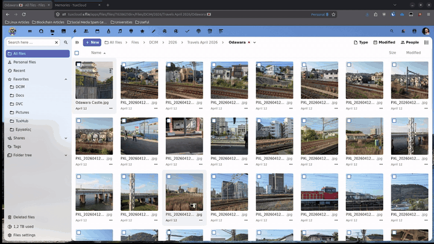

# GeoTag Photos

> Add GPS coordinates to your JPEG photos directly from the Nextcloud Files app.

**GeoTag Photos** lets you write GPS EXIF metadata into JPEG files so they appear on the map in [Nextcloud Maps](https://apps.nextcloud.com/apps/maps) and [Nextcloud Memories](https://apps.nextcloud.com/apps/memories) after a metadata rescan- no desktop software needed!

**Author:** Dimitris Vagiakakos ([@sv1sjp](https://github.com/sv1sjp))- [tuxhouse.eu](https://www.tuxhouse.eu)  
**License:** GNU AGPL v3 or later  
**Nextcloud:** 33  

---

## Features

- **Add / Replace GPS** - write latitude, longitude, and optional altitude to any JPEG
- **Read before overwrite** - existing coordinates are shown in the dialog before you change them
- **Clear GPS** - remove all GPS EXIF tags from a photo in one click
- **Batch tagging** - select multiple JPEGs and apply the same coordinates to all at once
- **Paste from Clipboard** - paste coordinates directly from Google Maps or any GPS app; supports decimal degrees (`38.083454, 23.697252`) and DMS (`38°05'21.1"N 23°42'42.0"E`)
- **Safe EXIF writes** - only GPS tags are touched; `DateTimeOriginal`, orientation, camera fields, and all other metadata are never modified



---

## Requirements

| Component | Version |
|---|---|
| Nextcloud | 33 |
| PHP | 8.1 or later |
| **exiftool** | any recent version |

### Installing exiftool on the server

```bash
# Debian / Ubuntu
apt install libimage-exiftool-perl

# Fedora / RHEL / CentOS
dnf install perl-Image-ExifTool

# Alpine Linux
apk add exiftool

# Arch / Manjaro
pacman -S perl-image-exiftool
```

> **Note:** exiftool must be installed on the machine running the Nextcloud PHP process (inside the container if you use Docker/Podman).

---

## Installation

### From the Nextcloud App Store *(recommended - soon)*

Search for **GeoTag Photos** in **Settings → Apps** and click Install.

### From a release archive

1. Download `geotagphotos.tar.gz` from the [releases page](https://github.com/sv1sjp/geotagphotos/releases).
2. Extract into your Nextcloud apps folder:
   ```bash
   tar -xzf geotagphotos.tar.gz -C /path/to/nextcloud/apps/
   ```
3. Enable the app:
   ```bash
   occ app:enable geotagphotos
   ```

### From source

```bash
cd /path/to/nextcloud/apps
git clone https://github.com/sv1sjp/geotagphotos.git
cd geotagphotos
npm install
npm run build
occ app:enable geotagphotos
```

---

## Usage

### Single photo

1. Right-click any JPEG in the Files app (or use the `⋮` action menu).
2. Click **Add Geolocation Tag**.
3. The dialog shows any existing coordinates. Enter new ones and click **Save** (or **Replace** if GPS already exists).
4. To remove all GPS data, click **Clear GPS**.

### Multiple photos

1. Select several JPEGs using the checkboxes.
2. Click **Add Geolocation Tag** in the selection toolbar.
3. Enter the coordinates to apply to all selected photos and click **Save**.

### Paste from Clipboard

Click **Paste from Clipboard** inside the dialog to auto-fill the latitude and longitude fields. Supported formats:

| Format | Example |
|---|---|
| Decimal degrees | `38.083454, 23.697252` |
| Decimal degrees (signed) | `-33.8688, -70.6693` |
| DMS | `38°05'21.1"N 23°42'42.0"E` |

Extra text or blank lines in the clipboard (e.g. when copying from Google Maps) are ignored automatically.

---

## GPS coordinate format

The app uses **decimal degrees (DD)**- the same format used by Google Maps.

| Direction | Sign | Example |
|---|---|---|
| North | + (positive) | `37.9838` |
| South | − (negative) | `-33.8688` |
| East  | + (positive) | `23.7275` |
| West  | − (negative) | `-74.0060` |

Altitude is in **metres**, positive above sea level and negative below.

---

## EXIF tags written

Only these tags are written- nothing else is touched:

| Tag | Description |
|---|---|
| `GPSLatitude` | Absolute latitude value |
| `GPSLatitudeRef` | `N` (north) or `S` (south) |
| `GPSLongitude` | Absolute longitude value |
| `GPSLongitudeRef` | `E` (east) or `W` (west) |
| `GPSAltitude` | Altitude in metres *(only if provided)* |
| `GPSAltitudeRef` | `0` above sea level / `1` below |

---

## Security

- **Authentication**- all API routes require a logged-in user (`@NoAdminRequired`).
- **Authorisation**- files are resolved through `IRootFolder→getUserFolder()`, so users can only tag files they own or have write access to.
- **MIME guard**- non-JPEG files are rejected at the PHP layer even if the frontend filter is bypassed.
- **Command injection**- `ExifService` calls exiftool via `proc_open` with an **array** command (no shell string), making injection structurally impossible.
- **Path traversal**- file paths are resolved through Nextcloud's storage layer and verified with `realpath()` before being passed to exiftool.

---

## Architecture

```
geotagphotos/
├── appinfo/
│   ├── info.xml              App metadata and NC version constraints
│   └── routes.php            REST API route table
├── lib/
│   ├── AppInfo/Application.php   Bootstrap- injects JS into Files
│   ├── Controller/GeotagController.php  GET / POST / DELETE endpoints
│   └── Service/ExifService.php   exiftool wrapper
├── src/
│   ├── main.ts               Registers the file action in the Files UI
│   └── components/GeotagModal.vue  Modal dialog (Vue 3, native HTML)
├── js/                       Compiled bundle (committed)
└── img/app.svg               App icon
```

### API endpoints

| Method | Path | Description |
|---|---|---|
| `GET` | `/apps/geotagphotos/api/exif/{fileId}` | Read GPS EXIF |
| `POST` | `/apps/geotagphotos/api/exif/{fileId}` | Write GPS EXIF |
| `DELETE` | `/apps/geotagphotos/api/exif/{fileId}` | Clear GPS EXIF |

---

## Troubleshooting

**"exiftool is not installed"**
Install exiftool on the web server- see [Requirements](#requirements). If using a container, install it inside the container image.

**"Only local storage is supported"**
External storage (S3, WebDAV, SFTP, etc.) is not supported. The photo must be on the Nextcloud server's local disk.

**Photo does not appear in Maps after tagging**
Run `occ maps:scan-photos` to force Maps to re-index GPS data from the file cache.

**Coordinates look wrong (flipped sign)**
Check the sign: latitudes south of the equator and longitudes west of Greenwich must be **negative**.

---

## Changelog

See [CHANGELOG.md](CHANGELOG.md).

---

## License

Copyright © 2026 Dimitris Vagiakakos @sv1sjp - TuxHouse EU

Licensed under the **GNU Affero General Public License v3.0 or later**.  
See [LICENSE](LICENSE) for the full text or visit <https://www.gnu.org/licenses/agpl-3.0.html>.
